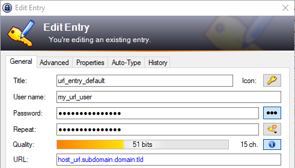
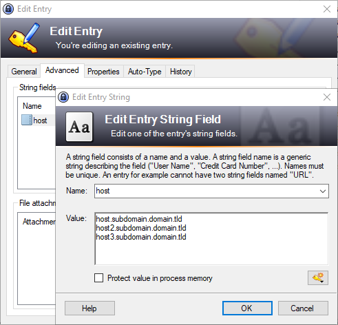
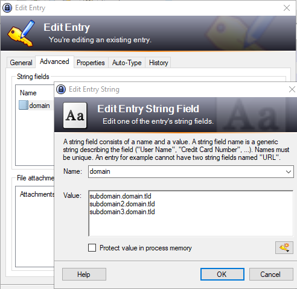
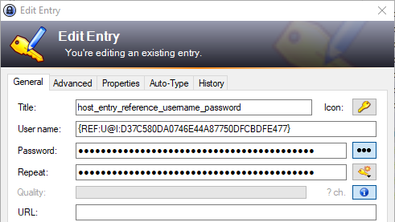

# Ansible KeePass plugin

## Logic

This collection provides two plugins, a lookup plugin and a vars plugin.
Each have their own role,

The vars plugin provide a way for keepass_psw variable to be set on a per run basis, using a gui pop up window asking for master password.

The lookup plugin uses the keepass_psw and other variables to search through the keepass database file for username and passwords for each host.

### Precedence


## Installation

Requirements: python3, pykeepass 4.1.0

```sh
pip install --user 'pykeepass==4.1.0'
ansible-galaxy collection install hczv.keepass
```

## Ansible variables

* keepass_dbx - This is required, points to the keepass.kdbx file

## Enable vars plugin

In order for ansible to load the vars plugin, it needs to be enabled.
Add the following to ansible.cfg for the project:

```
[defaults]
vars_plugins_enabled = host_group_vars,hczv.keepass.prompt_keepass_psw
```

This will trigger on each ansible run, and create a prompt asking for the credentials to the keepass.kdbx file.

## Examples

A lookup can be made based on either a hostname or domain name,

* The hostname is by default 'inventory_hostname', and can be overwritten per lookup
* The domain name is based on either the inventory_hostname or the overwritten value. The valus is extracted from the host, where everything up till and with the first dot is removed.

An example would be, the domain for 'host.subdomain.domain.tld' is 'subdomain.domain.tld' with the 'host.' removed.

### Hostname lookup

A host can be defined in the url field, or in the custom property "host"





With an ansible inventory where the hostname is defined like the following:

```yaml
all:
  hosts:
    host.subdomain.domain.tld:
      ansible_user: "{{ lookup('keepass', 'username') }}"
      ansible_password: "{{ lookup('keepass', 'password') }}"
```

You can set the lookup without any arguments, as it will default to the inventory_hostname for the lookup.
if other credentials are needed this logic can lookup based on a specific host instead:

```yaml
all:
  hosts:
    host.subdomain.domain.tld:
      ansible_user: "{{ lookup('keepass', 'username', 'my-other-host.subdomain.domain.tld') }}"
      ansible_password: "{{ lookup('keepass', 'password', 'my-other-host.subdomain.domain.tld') }}"
```

### Domain lookup

To make it simpler to match many hosts on singular entries in keepass you can use the domain field instead
this can be done like this:



and will match on all hosts within the domains, so
```yaml
all:
  hosts:
    host1.subdomain.domain.tld:
      ansible_user: "{{ lookup('keepass', 'username') }}"
      ansible_password: "{{ lookup('keepass', 'password') }}"
    host2.subdomain.domain.tld:
      ansible_user: "{{ lookup('keepass', 'username') }}"
      ansible_password: "{{ lookup('keepass', 'password') }}"
```

and so on.

## References

Keepass can reference other entries, the lookup plugin can follow these references, so with an entry like this:



it'll follow it and return the result.

