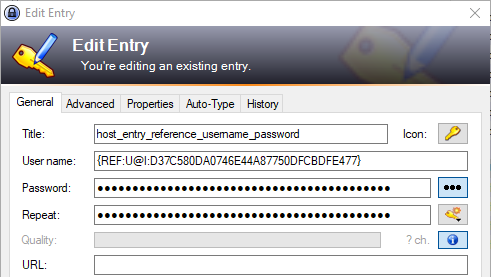

# Ansible KeePass plugin

## Logic

This collection provides two plugins: a lookup plugin and a vars plugin. Each has its own role.

The vars plugin provides a way for the `keepass_psw` variable to be set on a per-run basis, using a GUI pop-up window asking for the master password.

The lookup plugin uses the `keepass_psw` and other variables to search through the keepass database file for usernames and passwords for each host.

### Precedence

The lookup plugin follows a specific order of precedence when searching for matches:

1. URL Field: If a host matches the URL field of an entry, it will be considered a match.

2. Host Field: If a host does not match the URL field but matches the host field of an entry, it will be considered a match.

3. Domain Field: If neither the URL field nor the host field matches, a search will be performed based on the domain field.

If no match is found using any of the above criteria, an error will be returned.


## Installation

Requirements: python3, pykeepass 4.1.0

```sh
pip install --user 'pykeepass==4.1.0'
ansible-galaxy collection install hczv.keepass
```

## Ansible Variables

* `keepass_dbx` - This is required and points to the `keepass.kdbx` file.

## Enable vars plugin

In order for Ansible to load the vars plugin, it needs to be enabled. Add the following to `ansible.cfg` for the project:

```
[defaults]
vars_plugins_enabled = host_group_vars,hczv.keepass.prompt_keepass_psw
```

This will trigger on each Ansible run and create a prompt asking for the credentials to the `keepass.kdbx` file.

## Examples

A lookup can be made based on either a hostname or domain name.

* The hostname is by default `inventory_hostname` and can be overwritten per lookup.
* The domain name is based on either the `inventory_hostname` or the overwritten value. The value is extracted from the host, where everything up until and including the first dot is removed.

An example would be the domain for `host.subdomain.domain.tld` is `subdomain.domain.tld` with the `host.` removed.

### Hostname Lookup

A host can be defined in the URL field or in the custom property "host".


With an Ansible inventory where the hostname is defined as follows:

```yaml
all:
    hosts:
        host.subdomain.domain.tld:
            ansible_user: "{{ lookup('keepass', 'username') }}"
            ansible_password: "{{ lookup('keepass', 'password') }}"
```

You can set the lookup without any arguments, as it will default to the `inventory_hostname` for the lookup. If other credentials are needed, this logic can lookup based on a specific host instead:

```yaml
all:
    hosts:
        host.subdomain.domain.tld:
            ansible_user: "{{ lookup('keepass', 'username', 'my-other-host.subdomain.domain.tld') }}"
            ansible_password: "{{ lookup('keepass', 'password', 'my-other-host.subdomain.domain.tld') }}"
```

### Domain Lookup

To make it simpler to match many hosts on singular entries in keepass, you can use the domain field instead. This can be done like this:


and will match on all hosts within the domains. For example:

```yaml
all:
    hosts:
        host1.subdomain.domain.tld:
            ansible_user: "{{ lookup('keepass', 'username') }}"
            ansible_password: "{{ lookup('keepass', 'password') }}"
        host2.subdomain.domain.tld:
            ansible_user: "{{ lookup('keepass', 'username') }}"
            ansible_password: "{{ lookup('keepass', 'password') }}"
```

and so on.

## Keepass references

Keepass can reference other entries. The lookup plugin can follow these references. For example, with an entry like this:



it will follow it and return the result.

## More examples

For more examples - look at the integration tests and the keepass.kdbx file it uses for it.
